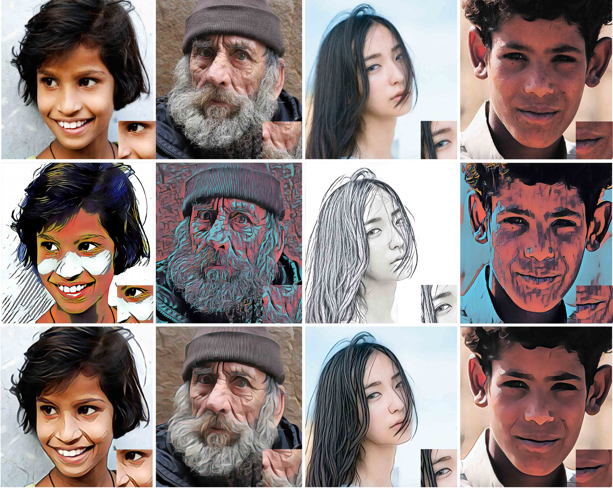
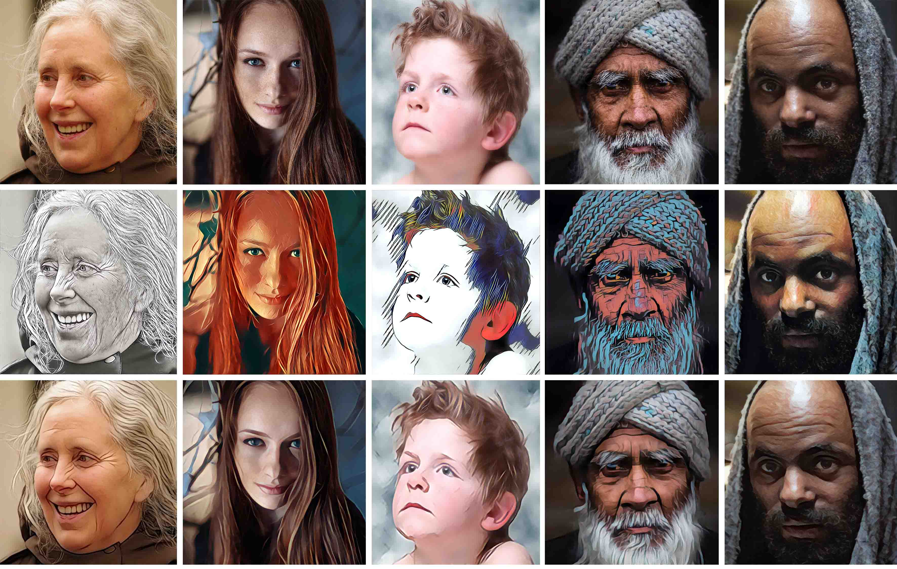
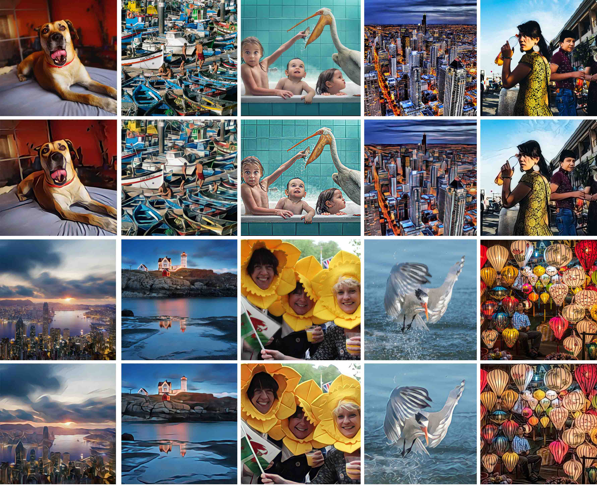

## Learning Selfie-Friendly Abstraction from Artistic Style Images

Yicun Liu | Jimmy Ren |  Jianbo Liu |  Jiawei Zhang | Xiaohao Chen   

This repository contains code for the paper: [Learning Selfie-Friendly Abstraction from Artistic Style Images](https://arxiv.org/abs/1805.02085).

Contact: Yicun Liu (stanleylau@link.cuhk.edu.hk)



#### Prerequisites
The code is tested on 64 bit Linux (Ubuntu 14.04 LTS). You should also install Matlab (We have tested on R2015a). We have tested our code on GTX TitanX (Maxwell) with CUDA8.0+cuDNNv5. Please install all these prerequisites before running our code.

#### Installation
1. Clone the code. 
   ```Shell  
   git clone https://github.com/DandilionLau/Selfie-Friendly-Abstraction.git 
   cd Selfie-Friendly-Abstraction  
   ```

2. Build standard caffe follow the [instruction](http://caffe.berkeleyvision.org/installation.html).    
   ```Shell
   cd caffe/
   # Modify Makefile.config according to your Caffe installation/. Remember to allow CUDA and CUDNN.
   make -j12
   make matcaffe
   ```

3. Cutomized caffe. Modify `caffe.proto` and append the following message to add configuration for new layer:   
   ```Proto
   Message Parameter{
   // not conflict with any existing numbers
     optional NNUpsampleParameter nn_upsample_param = 163;
   }
   message NNUpsampleParameter {
     optional uint32 resize = 1 [default = 2];
   }
   ```
   Copy `include/nn_upsample_layer.hpp` to `caffe/include/caffe/layers/`. Copy `src/nn_upsample_layer.cpp` and `src/nn_upsample_layer.cu` to `caffe/src/caffe/layers/`. Then recompile both caffe and matcaffe.   
   ```Shell
   make -j12
   make matcaffe
   ```

4. Download training models.
   If you only want to test the model, simply download our caffemodels from [[DropBox]](https://www.dropbox.com/s/1md2kewhmnhg6kl/style.zip?dl=0)[[BaiduYun]](https://pan.baidu.com/s/1mWnx6EyA1WuEUUZbfJu96g) and put them into the `model/style/` directory . Additionally, if you want to train your own model, pleasedownload the VGG-16 model from [[VGG Website]](http://www.robots.ox.ac.uk/~vgg/software/very_deep/caffe/VGG_ILSVRC_16_layers.caffemodel)[[DropBox]](https://www.dropbox.com/s/jwhjdqlg2g6y0bb/vgg16.caffemodel?dl=0)[[BaiduYun]](https://pan.baidu.com/s/1SWUx-7siOjsL-KlhDbyKTw) and put them into the `model/vgg_16layers/` directory.

#### Training
1. Generate image patches   
   Run `data/GenPatches_train_6chs.m` and ``data/GenPatches_test_6chs.m`` at MATLAB to extract image patches for training and validation. We provide 40 selfie images and their corresponding output images generated by `Prisma`. The image directory is at `data/training/`. You may replace it with your own dataset.   
2. Training the model   
   Run `train/train_6chs_reshape.m` at MATLAB to train the model. Remember to include matcaffe before runing test. In our experiment, the balance factor between loss_pixel and loss_feat is set as 1000.

#### Testing 
1. Run `test/test_6chs_reshape.m` at MATLAB to train the model. Remember to include matcaffe before runing test. We provide 99 images downloaded from Flikr for testing, includes portraits, landscapes, wild lifes and other view. The image directory is at `data/testing/`. You may replace it with your own dataset.  
2. For inter-frame consitency test, please visit our [online demo](https://youtu.be/0AsY26MHih4) to check the results.

#### Results

<p></p>
  

#### Citation

```
Please cite our paper if you find it helpful for your work:
@article{learn_sf_abs2018,
    title={Learning Selfie-Friendly Abstraction from Artistic Style Images},
    author={Yicun Liu, Jimmy Ren, Jianbo Liu, Jiawei Zhang, Xiaohao Chen},
    journal={arXiv preprint arXiv: 1805.02085},
    year={2018},
}
```

 

